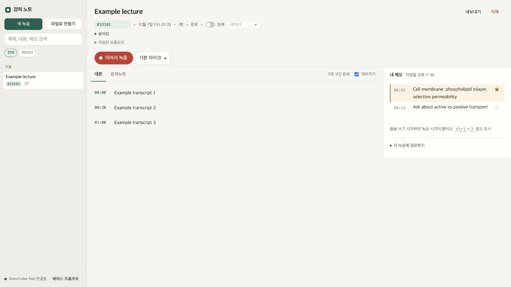

<p></p>

# Lecture Notes Studio

Record, transcribe, and turn lectures or meetings into notes on your own computer.
[Project site](https://lidge-jun.github.io/ocx-dictation-web/)



Lecture Notes Studio records a microphone or imports an audio/video file, transcribes in small segments through an OpenAI-compatible endpoint, keeps timestamped notes beside the transcript, and can draft an AI note. Recordings and notes are stored locally. The interface is in Korean; this guide is in English. [한국어 안내](README.ko.md).

## Requirements

- Node.js 22 or newer
- `ffmpeg` and `ffprobe` on `PATH` (or configure their paths)
- A running OpenCodex instance or another endpoint compatible with the transcription and chat-completions APIs
- A modern Chromium, Firefox, or Safari browser with Web Locks and BroadcastChannel for recording

## Quick start

```sh
git clone https://github.com/lidge-jun/ocx-dictation-web.git
cd ocx-dictation-web
npm start
# equivalently: node bin/ocx-dictation.mjs start
```

Open <http://127.0.0.1:10210>. The server binds to loopback only. If your endpoint needs a key, put it in `~/.ocx-dictation/config.json` or set `OCX_KEY` in the server environment. `doctor` checks `ffmpeg`, `ffprobe`, the endpoint's `/healthz`, and whether a key is configured; it exits 1 unless all four are present. That last pair is OpenCodex-oriented: a compatible endpoint without `/healthz` or without a key can still work even when `doctor` reports it. `paths` shows the active storage paths. CLI usage: `node bin/ocx-dictation.mjs start [--port N]`, `paths [--json]`, `doctor`, `migrate [--from <old-app-dir>] [--dry-run]`, `--help`, and `--version`. Omitting the command starts the server.

## What it does

- Captures 30-second segments, queues uploads safely in browser storage, and resumes after an interrupted tab.
- Shows live transcript, timestamps, and note editing; one tab owns the recorder while other tabs mirror its state.
- Refines text and drafts a note using the configured models; exports Markdown, text, or subtitles.
- Optionally saves Markdown to a configured vault directory. Vault export is disabled until configured.

## Configuration

Create `~/.ocx-dictation/config.json` with only the fields you need. Environment values override the file. The browser receives public model/course settings, never the endpoint key or filesystem paths.

| JSON field | Default | Environment override |
| --- | --- | --- |
| `port` | `10210` | `PORT` |
| `host` | `127.0.0.1` | `HOST` (loopback values only) |
| `ocxBase` | `http://127.0.0.1:10100` | `OCX_BASE` |
| `ocxKey` | empty | `OCX_KEY` |
| `transcribeModel` | `gpt-4o-transcribe` | — |
| `noteModel` | `gpt-6-luna` | — |
| `refineModel` | `gpt-6-luna--fast` | — |
| `concurrency` | `2` | — |
| `timezone` | system time zone | `OCX_DICTATION_TZ` |
| `courses` | `[]` | — |
| `ffmpegPath` | `ffmpeg` | `FFMPEG_PATH` |
| `ffprobePath` | `ffprobe` | `FFPROBE_PATH` |
| `vault` | `null` (off) | — |

See [configuration](docs/configuration.md) for validation, vault settings, and examples.

## Storage and migration

The default home is `~/.ocx-dictation` (`OCX_DICTATION_HOME` changes it). Configuration is `config.json`; recordings are under `data/sessions/<id>/`; prompt settings are under `data/prompts.json`. `DATA_DIR` overrides the data directory alone. A legacy source-folder installation can be detected and used in place until you choose to migrate; it is not automatically moved. Check `paths`, stop the old recorder, back up your data, then run `node bin/ocx-dictation.mjs migrate --from <old-checkout-dir> --dry-run` and repeat without `--dry-run` when the destination home is empty. Omit `--from` only when the old `data/` or `config.local.json` lives in this checkout. Migration copies and verifies by size and SHA-256, leaves the source intact, and refuses overlapping/nonempty destinations or source symlinks. See [configuration](docs/configuration.md#migrating-an-older-installation).

## How it works

The browser makes WAV segments and saves them to IndexedDB before upload. The Node server stores audio and metadata, calls the configured endpoint for transcription and note generation, and streams progress with server-sent events. `ffmpeg` merges or splits audio. The recorder lock covers the whole origin, so only one tab can use the microphone at a time. [Architecture](docs/architecture.md).

## Privacy and security

The HTTP server accepts loopback hosts only, validates mutation Origin and cross-site fetch metadata, limits request sizes, and sends restrictive browser headers. It has no telemetry. Session data stays in local files and browser IndexedDB; audio and text sent to the configured model endpoint are subject to that endpoint's policy. The endpoint key is read by the Node process and is never sent to the browser. Treat anyone with access to your account or local loopback socket as within the local trust boundary. [Privacy details](docs/privacy.md) · [Security reports](SECURITY.md).

## Keyboard shortcuts

| Shortcut | Action |
| --- | --- |
| `Enter` in a note | Insert a timestamped note line |
| `Ctrl/⌘ + J` in a note | Toggle important |
| `Ctrl/⌘ + Shift + M` in a session | Mark the current moment |
| `/` outside an input | Focus library search |

## Development

```sh
npm test
npm run check
npm run privacy
```

The privacy scan checks the prospective public tree; it does not certify old history. Public publishing uses a fresh sanitized root. See [contributing](CONTRIBUTING.md), [maintainer map](structure/INDEX.md), and [changelog](CHANGELOG.md).

Licensed under [MIT](LICENSE).
